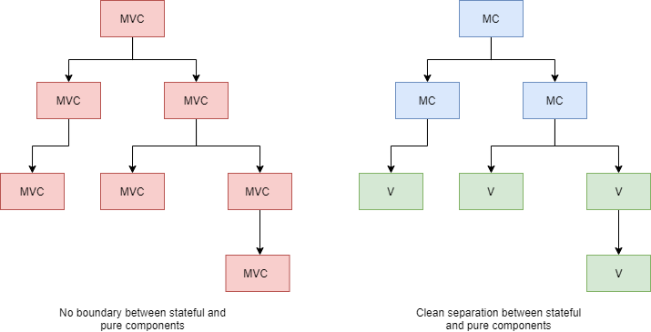

# Beginner to Intermediate React

- [Intended Audience](#intended-audience)
- [Tools](#tools)
- [Fundamentals Through The Lens of React](#fundamentals-through-the-lens-of-react)
  - [Simplicity](#simplicity)
  - [Abstraction](#abstraction)
  - [Conceptual Integrity](#conceptual-integrity)
  - [DRY](#dry)
- [Beginner to Intermediate Refactoring](#beginner-to-intermediate-refactoring)
  - [Component Design And Boolean Props](#component-design-and-boolean-props)
  - [Blobs](#blobs)
  - [Hook Abuse](#hook-abuse)
  - [From Booleans to Enums](#from-booleans-to-enums)
- [Experimental Patterns](#experimental-patterns)
  - [MC-V Trees](#mc-v-trees)
  - [Smart Children](#smart-children)
- [References](#references)

## Intended Audience

This work is intended for beginners who are familiar with TypeScript and React syntax and idioms. The reader may have created a handful of React components. Experienced programmers can quickly get up to speed by reading the [TypeScript](https://www.typescriptlang.org/docs/) and [React documentation](https://reactjs.org/docs/getting-started.html). The end goal is to provide the reader with a set of tools and guidelines for creating better React components.

## Tools

> "A man is only as good as his tools." - Emmert Wolf

A caveman's artistic abilities are limited by his medium and substrate: berries and cave walls. Similarly, a programmer's productivity will be limited when using notepad and a primitive compiler. To reach maximum productivity, a good code editor is essential. There are many to choose from. At a minimum, a good code editor should support static analysis, refactoring operations, and code formatting. [Visual Studio Code](https://code.visualstudio.com/) is a good choice that supports all of this and more.

Static analysis finds code issues automatically and can save hours of development time and requires only a minor upfront investment. It reduces cognitive overhead by alerting the programmer to forgotten rules and requirements. This Includes accessibility tips, best practices, and common errors. A good starting point is the [ESLint extension](https://marketplace.visualstudio.com/items?itemName=dbaeumer.vscode-eslint). It is highly recommended to install the [React ESLint plugin](https://www.npmjs.com/package/eslint-plugin-react) as well. Especially if one is still struggling with hook semantics. [Checkr](https://marketplace.visualstudio.com/items?itemName=checkr.checkr) is recommended for project specific static analysis.

A code formatting tool keeps stylistic consistency (tabs vs spaces) across source code. It is unrealistic to expect anyone to remember all stylistic choices at all times, even if they're thoroughly documented. Nor is it a good use of time to repeatedly debate stylistic choices. [Prettier](https://prettier.io/) is a solid code formatting tool with VS Code support that can be configured to specific needs and supports formatting on save. It can also be configured to run on git check-out and check-in.

## Fundamentals Through The Lens of React

There are many guidelines and heuristics that software developers apply when writing code. As a beginner, it is impossible to keep them in mind at all times. As experience grows, guidelines become part of the subconscious. Stating guidelines is easy. However, internalizing, understanding, and feeling the deeper meaning requires years of effort. It is still useful to share a small fraction of these guidelines and provide demonstrative examples. Knowing such guidelines allows a framework for evaluation, and a path towards improvement. For brevity, many guidelines will not be covered. However, entire books have been written on guidelines and are available for the curious reader. The references provide a great start for additional reading [[1]](#references)[[2]](#references)[[3]](#references)[[4]](#references)[[5]](#references)[[6]](#references).

### Simplicity

> Perfection is achieved, not when there is nothing more to add, but when there is nothing left to take away.
> Antoine de Saint-Exupery.
>
> The hardest program I’ve ever written, once you strip out the whitespace, is 3,835 lines long. That handful of code took me almost a year to write. Granted, that doesn’t take into account the code that didn’t make it. The commit history shows that I deleted 20,704 lines of code over that time. Every surviving line has about three fallen comrades.
> [Bob Nystrom](http://journal.stuffwithstuff.com/2015/09/08/the-hardest-program-ive-ever-written/)

Simple code does not add unnecessary context, nor does it omit necessary context. It meets the requirements concisely. A programmer reads simple code and thinks nothing of it. It is how they imagine they would've solved the problem in the first draft. However, they are deluded. Writing simple code is a process that is not as straightforward as the final code itself. Thus, in its poetic simplicity, simple code is often underappreciated. Similar to a server admin with 99.99% uptime; nobody notices a job well done. However, constantly striving for simple code is a joy unto itself, wherein the process is often more enjoyable than the end result.

Simple code lends itself to changing requirements, easy debugging, and a pleasant maintenance experience. Unfortunately, simple code does not come for free. It requires thoughtfulness, ruthless introspection, and a willingness to critically assess feedback.

Programmers are adept at seeing patterns, sometimes in a disadvantageous way. Unrelated systems are bound or merged together in the name of "code reuse" or "deduplication", because they happen to share a few superficial properties. Simple code makes no such mistake and flows linearly down, with little control structures obstructing the path. It actively avoids knowing about other parts of the system unless it is crucial property.

In the proceeding sections, guidelines to move the needle towards simplicity will be given.

### Abstraction

Simplicity flows from many factors. To begin with, simple code minimizes the chunks of information a programmer must keep in working memory. Clean abstractions can do just that. For example, making an HTTP request in JavaScript is as simple as `fetch('http://news.com/daily-stories.json')`. The author need not understand the seven layers of the networking OSI model, which contains hundreds of definitions, rules, and semantics. Thus, even if the interface of `fetch` could be improved, programmers are thankful to avoid manually setting up TCP handshakes. An exemplary React component of good abstraction might look like-so.

```jsx
<CreditCardForm
    onSuccess={transactionInfo => ...}
    onPending={transactionInfo => ...}
    onFailure={(transactionInfo, errorCode) => ...}
/>
```

An entire credit card form to collect payments is finished in a few lines of code. Knowledge of `transactionInfo` and `errorCode` are still required. However, `transactionInfo` can be slimmed down from all the details a credit card transaction typically provides. A `handleFailure` function can be exported from the credit card module if the developer wants a sensible default. Various credit card compliance regulations and rules are handled internally by `CreditCardForm`. State transitions are also handled by the `CreditCardForm`. Although it could be refactored to have state passed in as props, with a default `useCreditCardForm` hook providing the state management.

Good abstractions typically follow an "onion" approach. High level components sit on top, but the mid and low level components used to build them are still accessible to the consumer- should they want to deviate from the norm. From this, the "best of both worlds" can be achieved with minimal upfront work. If an onion design is not followed, typically mid and low level building blocks become heavily coupled to the top level component. When this happens, refactors cost orders of magnitude more time and money to undo. Many will simply "double down" on the massive top level component and add _yet another prop_ to support a "one off" feature. With passing time, adding a button is suddenly a two week task. This needn't be the case.

Abstractions can present themselves naturally by representing the domain. For example if the domain is a hospital web app, finding a `PatientPortal` component or a `MedicalRecord` component is not surprising. When components roughly represent reality, a maintainer's intuition allows for easy searching of abstractions and provide clean delineation of boundaries. If such abstractions do not become apparent, it could be a sign that the domain is poorly understood. More exploration and requirements gathering may be necessary.

### Conceptual Integrity

Good abstractions have clean _conceptual integrity_. They are not vague, e.g. `ThingDoerComponent`, nor are they a mishmash of random features bundled together. They have well defined boundaries. A `Button` component should not have a `currentTemperature` prop. The concept should live in the `WeatherDashboard` and be passed to the `Button` through a clean interface.

```jsx
// In WeatherDashboard.tsx
function WeatherDashboard(...) {
...
    return (
        <div>
            ...
            <Button onClick={() => alert(currentTemperature)}>
                Show current temperature
            </Button>
        </div>
    );
}
```

At lower levels, this becomes obvious, but this should be the case in the mid to higher levels of abstraction as well. Deciding what concepts each component should know about, and _not_ know about is a hard task and often only learned through practice. When building components, each prop should be scrutinized as a concept the component knows about. If it feels as-if the component "knows too much", the interface should be generalized to support the needed functionality. In the `Button` example above; the button does not have a `currentTemperature` prop, but it supports the functionality _indirectly_ with callbacks and lower level primitives, such as generic strings.

### DRY

Most beginner to intermediate developers have heard of "DRY", or "Don't Repeat Yourself" [[6]](#references). However, it is more aptly called the "Single Point of Truth" principle (SPOT) [[5]](#references).

The principle states that information should live in one place, and one place only. For example, a file called `colorPalette.ts` with a list of theme color codes is far preferable to repeatedly copy pasting the color codes throughout the app. This is not necessarily to avoid the "magic numbers" of color codes, but to encode a single place for the apps color palette. When the color palette is updated, refactoring becomes easier by explicitly documenting which spots need to be checked. DRY code makes connections easy to follow. Conversely, dangerous code hides connections. When this happens, deleting innocuous lines in one file silently breaks another part of the codebase.

SPOT does not only apply to variables. It also applies to code itself: functions, components, classes, the like. Problems arise when the `Button` component is pasted into two different files, but the requirements call for _the same_ button in those two places. Future maintainers are setup for failure by not realizing they need to update the button in two places. There is a fine distinction here. Two buttons may _happen_ to be the same initially, however they may grow and change differently. In that case, using two different components would be the correct approach, even if the code is identical. _This is known as coincidental duplication_. If DRY is applied to coincidental duplication, future maintainers will likely assume the two buttons _should_ be identical. As the requirements diverge, they will add divergent props to support two different contexts. The resultant component quickly becomes Frankenstein's monster. These types of components can be identified by their unusually large prop list, or various props that are only used by one or two parent components. In these circumstances, it is usually best to dissolve the components into `n` different subcomponents, and refactor all the usages where appropriate.

Another form of duplication is _syntactical duplication_. In this case some lines of code or parameters are repeated. It typically looks like this.

```jsx
<Button color="green" fontSize="22" .../>

// Becomes:
<LargeGreenButton .../>
const LargeGreenButton = ({children, ...rest}) => (
    <Button {...rest} color="green" fontSize="22">
        {children}
    </Button>
);
```

There is nothing inherently wrong with DRY-ing up syntactical duplication. When applicable, it is less appealing than refactoring duplication into domain components. This would look more like so.

```jsx
<Button color="green" fontSize="22" ...>

// Button is refactored into a domain component:
<PurchaseButton .../>
const PurchaseButton = ({children, ...rest}) => (
    <Button {...rest} color="green" fontSize="22">
        {children}
    </Button>
);
```

## Beginner to Intermediate Refactoring

> "Peoples’ belief in their own approach to getting things done can result in them ignoring higher performing alternatives; this behavior has become known as the illusion of control."
>
> _Evidence-based Software Engineering_

This section will cover common anti-patterns in React and give the reader a few powerful patterns to refactor them. The reader is encouraged to keep an open mind and try things out, even if it's different from "what's always been done". It is important to keep a few things in mind.

> If it ain't broke, don't fix it.

Refactoring rarely modified or used code is effort better spent elsewhere. Not every component or function needs to be a work of art. Throwing a few functions into a small local module named `utils.ts` is rarely a long term maintenance issue, provided the code is refactored as necessary. However, a massively tangled global module may be a different story.

Another important consideration is project size and complexity. Best practices for larger projects many not be applicable with prototypes or simple projects. If a programmer is only familiar with smaller, less complex projects, many of these recommendations will rightfully come across as needless or overly complicating.

### Component Design and Boolean Props

When a new requirement is presented, tacking on functionality with a Boolean prop is tempting. It's straightforward and requires little thought. Take for example, a `HotDogStand` component that originally listed a few prices and displayed a banner. The owner, Frank, now wants to add lemonade to a few stands. Here's how this would be included using a Boolean prop.

```jsx
import React from "react";

interface Props {
  bannerTextColor: string;
  hasLemonade: boolean;
}

function HotDogStand(props: Props) {
  const { bannerTextColor, hasLemonade } = props;
  const bannerText = "Frank's Hot Dogs" + (hasLemonade ? " And Lemonade" : "");
  return (
    <div>
      <div style={{ color: bannerTextColor }}>{bannerText}</div>
      <ul>
        <li>Regular Dog $4.99</li>
        <li>Chili Dog $6.99</li>
        <li>Double Dog $7.99</li>
        {hasLemonade && <li>Lemonade $2.99</li>}
      </ul>
    </div>
  );
}
```

Not hard to understand, but this won't scale as requirements grow. Inevitably, Frank will want to add more menu items. He'll want to change the banner text. The banner text color may be different based on menu items or day of the week. If more Boolean flags are added to support these requirements, the code becomes increasingly tangled, opaque, and cemented. Here's how the component may look in a year if this continues.

```jsx
import React from "react";

interface Props {
  bannerTextColor: string;
  hasLemonade: boolean;
  hasChurros: boolean;
  hasSoda: boolean;
  isOutOfRegularHotDogs: boolean;
  isDoubleDogTuesday: boolean;
  isHomeGameDealsOn: boolean;
  isBreastCancerAwarenessMonth: boolean;
}

function HotDogStand(props: Props) {
  const {
    bannerTextColor,
    hasLemonade,
    hasChurros,
    hasSoda,
    isOutOfRegularHotDogs,
    isDoubleDogTuesday,
    isHomeGameDealsOn,
    isBreastCancerAwarenessMonth,
  } = props;
  const bannerText =
    "Frank's Hot Dogs" + (hasLemonade && !hasChurros ? " And Lemonade" : "");
  const regularDogPrice = isHomeGameDealsOn ? "$2.99" : "4.99";
  const regularDogText = isOutOfRegularHotDogs ? (
    <s>{`Regular Dog ${regularDogPrice}`}</s>
  ) : (
    "Regular Dog " + regularDogPrice
  );
  const chiliDogPrice = isHomeGameDealsOn ? "$5.99" : "6.99";

  return (
    <div>
      <div
        style={{
          color: isBreastCancerAwarenessMonth ? "pink" : bannerTextColor,
        }}
      >
        {bannerText}
      </div>
      <ul>
        <li>{regularDogText}</li>
        <li>Chili Dog {chiliDogPrice}</li>
        <li>Double Dog {isDoubleDogTuesday ? "$5.99" : "$7.99"}</li>
        {hasLemonade && <li>Lemonade $2.99</li>}
        {hasSoda && <li>Soda $0.99</li>}
        {hasChurros && <li>Churro $1.99</li>}
      </ul>
    </div>
  );
}
```

The code has become a big ball of mud. As John Outserhout notes, bad software is usually not the result of one bad decision, it is the accumulation of hundreds of papercuts [[3]](#references).

There are many things markedly wrong with this code. A casual reader couldn't know what this invocation does without looking at the internals of `HotDogStand`.

```jsx
<HotDogStand
  bannerTextColor={"blue"}
  isBreastCancerAwarenessMonth={Date.now().getMonth() == OCTOBER} // What does this do?
  isHomeGameDealsOn={checkIsHomeGame()} // What does this do?
  hasLemonade={lemonadeCount > 0} // What does this do?
/>
```

This opaque code does not lend itself to readability, encapsulation, or reuse. Props should give a clear indicator of _what_ not _why_. A pink banner or 20% off is a _what_. Breast cancer awareness month and home game deals are _why_ they should occur. It is clear `HotDogStand` knows too much about the code rendering it. A hotdog stand should have no concept of "Breast cancer awareness month", but it should support changing various things when it is Breast cancer awareness month.

It also creates subtle bugs; `bannerTextColor` is overridden by toggling on `isBreastCancerAwarenessMonth`. This is not immediately obvious to the reader.

To refactor this component, the proper "axis of change" needs to be identified. The design should be approached as building a system that supports features, not as a conglomeration of features bundled together. This is not an easy task, and one of the most satisfying parts of component design.

A `HotDogStand` at its core, is a banner and a menu. If the `HotDogStand` was decomposed into primitive building blocks it would look similar to this,

_HotDogStand = Banner  × Menu_

Decomposing this further, the banner has its own set of properties, such as color and text. The menu has its own set of properties such as price and the status of each item.

As the requirements grew, all the underlying component needed was a way to change the banner and menu items. The `isBreastCancerAwarenessMonth` flag is supported by choosing the proper value on the decomposed axis,

(_Pink Banner, Menu_) ∈ _HotDogStand_.

The Boolean flag can be dissolved and replaced by this,

```jsx
const isBreastCancerAwarenessMonth = Date.now().getMonth() == OCTOBER;
<HotDogStand
  bannerTextColor={isBreastCancerAwarenessMonth ? "pink" : "blue"}
  isHomeGameDealsOn={checkIsHomeGame()}
  hasLemonade={lemonadeCount > 0}
/>;
```

Moving on, the next features to support are `isHomeGameDealsOn` and `hasLemonade`. Both of which are values on the Menu axis. `hasLemonade` is also a value on the Banner axis. There are many ways to approach this refactor, each with varying advantages and disadvantages. Here is a straightforward way, but other approaches will be explored later.

```jsx
import React from 'react';

interface MenuItem {
    name: string;
    price: string;
    stock: number;
}

interface Props {
    bannerText: string
    bannerTextColor: string;
    menuItems: MenuItem[];
}

export const standardBannerText = "Frank's Hot Dogs";
export const standardMenu: MenuItem[] = Object.freeze([
    {name: "Regular Dog", price: "$4.99", stock: 1000 },
    {name: "Chili Dog", price: "$6.99", stock: 1000 },
    {name: "Double Dog", price: "$7.99", stock: 1000 },
]);

function HotDogStand(props: Props) {
    const { bannerTextColor, menuItems } = props;
    return (
        <div>
            <div style={{"color": bannerTextColor}}>{bannerText}</div>
            <ul>
                {'/* Name is treated as a unique key for convenience. */'}
                {menuItems.map(item => stock > 0 ?
                    <li key={item.name}>{`${item.name} ${item.price}`}</li> :
                    <li key={item.name}><s>{`${item.name} ${item.price}`}</s></li>);
                )}
            </ul>
        </div>
    );
}
```

Consuming the component now looks like so.

```jsx
import { HotDogStand, standardMenuItems } ...;

const isBreastCancerAwarenessMonth = Date.now().getMonth() == OCTOBER;
const homeGameDealsMenu: MenuItem[] = Object.freeze([
    {name: "Regular Dog", price: "$2.99", stock: 1000 },
    {name: "Chili Dog", price: "$5.99", stock: 1000 },
    {name: "Double Dog", price: "$7.99", stock: 1000 }]);
const menuItems = [
    ...(checkIsHomeGame() ? homeGameDealsMenu : standardMenuItems),
    {
        name: "Lemonade",
        price: "$2.99",
        stock: 1000,
    }];

<HotDogStand
    bannerText={"Frank's Hot Dogs And Lemonade"}
    bannerTextColor={isBreastCancerAwarenessMonth ? "pink" : "blue"}
    menuItems={menuItems}
/>
```

Each requirement has been met, without a tar pit of Boolean props. Some requirements have been omitted for brevity, such as `hasChurros`, but are easily added with this new design.

There are some finer points that should be noted. Firstly, `bannerText` was set as `"Frank's Hot Dogs and Lemonade"` instead of the more DRY alternative, `standardBannerText + " And Lemonade"`. This was a deliberate decision. Too much DRY hurts readability and adds complexity, even if it's DRY done right. The matter of "too much" comes down subjectivity that is honed through experience. Secondly, `price` could have been merged with `name`, or it could have been of type `number` to allow applying discounts more easily. The menu items could have been placed in their own module, `menuItems.ts`, such that making menu updates would be more clear and have better separation of concerns. And `homeGameDealsMenu` could have been implemented as a `map` function over `standardMenuItems`. These are all stylistic decisions with no absolute answer.

Allowing the consumer to pass in arbitrary menu items brings at hand the question of conceptual integrity. Arguably a `HotDogStand` component should have hot dogs on the menu. It may be reasonable to hardcode hot dogs as a required list item, or rename the component to `FoodStand`. Perhaps even having a `FoodStand` component and a `HotDogStand` component implemented in terms of `FoodStand`. These are the types of questions one should keep in mind when building components. The design of thoughtful components can be more complicated than the surface level suggests.

In the next section we'll explore more improvements to the `HotDogStand` component.

### Blobs

In the last section the `HotDogStand` component was refactored to reduce props, improve clarity, and improve flexibility. But it's still a bit blobby. A "blob component" is a component that requires a longlist of props, and starts to look more like a giant configuration file. The props are typically rigid and constantly require adding more options to support new edge cases or contexts. Overtime, these components become unwieldy, less reusable, and harder to decompose. The concrete sets in.

Good React looks more like an extension of HTML and less like a few giant configuration blobs. Here's the `HotDogStand` decomposed into pleasant HTML-like components.

```jsx
import { HotDogStand, standardMenuItems, standardBannerText } ...;

return (
    <HotDogStand.Banner color="pink" fontSize="22">
        {standardBannerText}
    </HotDogStand.Banner>
    <HotDogStand.Menu>
        <HotDogStand.MenuItem>
            [Daily Special] Churros - $1.99
        </HotDogStand.MenuItem>
        {standardMenuItems.map(item =>
            <HotDogStand.MenuItem key={item.name}>
                {`${item.name} - ${item.price}`}
            </HotDogStand.MenuItem>)}
    </HotDogStand.Menu>
);
```

Now callers of `HotDogStand` can build specific structure for their unique needs. A default `HotDogStand` with the usual structure can be exported as `HotDogStand.Default`. Here's the updated `HotDogStand` module.

```jsx
import React from 'react';

interface MenuItem {
    name: string;
    price: string;
    stock: number;
}

interface Props {
    bannerText: string
    bannerTextColor: string;
    menuItems: MenuItem[];
}

export const standardBannerText = "Frank's Hot Dogs";
export const standardMenu: MenuItem[] = Object.freeze([
    {name: "Regular Dog", price: "$4.99", stock: 1000 },
    {name: "Chili Dog", price: "$6.99", stock: 1000 },
    {name: "Double Dog", price: "$7.99", stock: 1000 }]);

// Pretend these have useful CSS stylings and aren't plain HTML tags.
Menu = ({children, ...rest}) => <ul {...rest}>{children}</ul>;
MenuItem = ({children, ...rest}) => <li {...rest}>{children}</li>;
Banner = ({children, ...rest}) => <div {...rest}>{children}</div>;
HotDogStand = ({children, ...rest}) => <div {...rest}>{children}</div>;

function Default(props: Props) {
    const { bannerTextColor, menuItems } = props;
    return (
        <HotDogStand>
            <Banner>{bannerText}</Banner>
            <Menu>
                {'/* Name is treated as a unique key for convenience. */'}
                {menuItems.map(item => stock > 0 ?
                    <MenuItem key={item.name}>{`${item.name} ${item.price}`}</MenuItem> :
                    <MenuItem key={item.name}><s>{`${item.name} ${item.price}`}</s></MenuItem>);
                )}
            </Menu>
        </MenuItem>
    );
}

HotDogStand.Menu = Menu;
HotDogStand.MenuItem = MenuItem;
HotDogStand.Banner = Banner;
HotDogStand.Default = Default;
export HotDogStand;
```

A diligent reader may note these components are possibly too granular. Without a standard set of CSS applied, or more meat, these components are a little too barebones. However, this is merely a toy example. In real projects, this pattern can be applied much more ergonomically with great benefit.

It may be tempting to apply this pattern to every blob, but blobs are not necessarily bad. Near the top levels of the React tree, they may even be essential. This is merely another tool in the React developer's belt.

### Hook Abuse

A standard tool in React is the hook. However, its forgotten brother, the plain old function, is also a useful tool. Hooks with a giant dependency lists are prevalent in React,

```jsx
const doFoobar = useCallback(() => {
    ... handle stuff here.
}, [... dozens of dependencies... ]);
```

The issue is compounded when `doFoobar`'s dependencies are also callbacks with their own long chain of dependencies. Complicated closures are harder to reason about than regular functions. Extracting out functionality quickly becomes a nightmare. Render bugs become commonplace. Functions run into these sort of issues less.

```javascript
function doFoobar(dependency1, dependency2, ...) {
    ...handle stuff here.
}
```

The function version can handle state updates in a few ways.

```jsx
// Pass the `set` hook function directly.
function doFoobar(dependency1, dependency2, ..., setName) {
    ... compute some result here.
    setName(result);
}

function BazComponent(props) {
    const [name, setName] = useState("");
    return (
        <input
          onChange={() => doFoobar(..., setName)}
        />
    );
}
```

```jsx
// Return the result directly
function doFoobar(dependency1, dependency2, ...) {
    ... compute some result here.
    return result;
}

function BazComponent(props) {
    const [name, setName] = useState("");
    return (
        <input
            onChange={() => {
                const result = doFoobar(...);
                setName(result);
            }}
        />
    );
}
```

The later is normally preferred as it is usually less coupled, more reusable, and more pure.

### From Booleans to Enums

Booleans are perfect at expressing binary state, on or off. They should be avoided for "one and only one" situations.

```jsx
function TextEditor(props) {
  // TextEditor is always one (and only one) of these modes.
  const [isWriteMode, setIsWriteMode] = useState(true);
  const [isEditMode, setIsEditMode] = useState(false);
  const [isHotkeyMode, setIsHotkeyMode] = useState(false);

  return <div>...</div>;
}
```

Becomes,

```jsx
enum Mode {
    Write,
    Edit,
    Hotkey
}

function TextEditor(props) {
    // TextEditor is always in one (and only one) of these modes.
    const [mode, setMode] = useState(Mode.Write);

    return <div>...</div>;
}
```

By converting the mode from Boolean flags to a single enum, the code is clearer and the variable count is reduced. JavaScript pseudo-enums can be created like so.

```javascript
export const mode = Object.freeze({
  write: "write", // or write: Symbol('write')
  edit: "edit",
  hotkey: "hotkey",
});
```

## Experimental Patterns

In this section, patterns that have arisen but are not necessarily widespread or standardized are presented. Readers are welcome to open a [poll request](https://github.com/ELanning/beginner-to-intermediate-react/pulls) with their own patterns.

### MC-V Trees

A standard division of UI responsibilities is the concept of MVC, or Model-View-Controller. For example, the model may be the user's information, including email address, name, and phone number. The view might be the "sign up" page. And the controller being the component that handles updating the model. In React, this is typically done all in one component.

```jsx
function SignUpPage(props) {
    // Model.
    const [name, setName] = useState(null);
    const [email, setEmail] = useState(null);
    const [phone, setPhone] = useState(null);

    // Controller.
    const handleNameChange = useCallback(e => { ... setName(...)});
    const handleEmailChange = useCallback(e => { ... setName(...)});
    const handlePhoneChange = useCallback(e => { ... setName(...)});
    const handleSubmit = useCallback(e => ...);

    // View.
    return (
        <div>
            <input name="name" onChange={handleNameChange} />
            <input name="email" onChange={handleEmailChange} />
            <input name="phone" onChange={handlePhoneChange} />
            <button name="submit" onChange={handleSubmit} />
        </div>
    );
}
```

This is completely readable and straightforward. There is nothing wrong with this component as-is. The issue arises once this component is used by another component, which is used by another component, and so on. If some component higher in the render tree needs to be extracted and used in another project or context, it comes with all the context of its child components. This is a standard issue in Object Oriented Programming. A class comes with the whole context. And that context is generally heavily coupled to the original use-case.

> I think the lack of reusability comes in object-oriented languages, not functional languages. Because the problem with object-oriented languages is they’ve got all this implicit environment that they carry around with them. You wanted a banana but what you got was a gorilla holding the banana and the entire jungle.
>
> Joe Armstrong

React was smart to do away with inheritance, but this issue remains with composition. There are some key mitigations to lessen the pain of this situation. A multipronged solution is the return to MVC inspired organization, separation of state and view, and applied lessons from functional programming. To start, code is structured into view components with a default hook, and a top level model-controller component which manages the currently active view. Here is how a refactored React render tree might look. Note the separation of the model-controller (state) layers and the view (pure) layers.



View nodes are _pure components_ only concerned with _view logic_. View logic may be turning a date into a human readable format, styling a string beautifully, and various layout concerns. A view component may contain other view components, but it may not contain a model-controller component. A model-controller component may contain other model-controller components and/or view components. There are many benefits to this division of responsibility in large applications. _However, In small applications not intended for reuse, it is mostly boilerplate._

The problem of baggage context mostly goes away. If another project wants to reuse the `SignUpPage`, they can grab the view component and plugin their own callbacks. If they want the state and the view, they grab the model-controller component above. With the left design in the graphic, reusing a component in a different context requires gutting most of the internals and the child components internals. In a large app, that process may require weeks to months of work, while the former may be achieved in a couple of days.

Pure view components are also easier to test and reason about than stacked MVC components. This clean delineation lends itself to easy modifications and searchability. A maintainer will know where state and view logic should live, and thus quickly narrow their search down.

Here's how a typical MC-V tree setup might look at the code level,

```jsx
enum View {
    EmailStep,
    UserInfoStep,
    FinishedStep,
};

// Model-Controller component.
function SignUpPage(props) {
    const [view, setView] = useState(View.EmailStep); // starts on the Email step

    // Email step state.
    const { email } = useEmailStep();

    // User info step state.
    const { name, address, phoneNumber } = useUserInfoStep();

    // Finished step.
    const { animationState, handleAnimationChange } = useFinishedStep();

    // Pure View components.
    switch (view) {
        case View.EmailStep:
            return <EmailStep
                       emailInput={email}
                       onNextButtonClick={() => setView(View.UserInfoStep)} />;
        case View.UserInfoStep:
            return <UserInfoStep
                       nameInput={name}
                       addressInput={address}
                       phoneNumberInput={phoneNumber}
                       onNextButtonClick={() => setView(View.FinishedStep)} />;
        case View.FinishedStep:
            return <FinishedStep
                       animationState={animationState}
                       onAnimationChange={handleAnimationChange} />;
    }
}

// `EmailStep.tsx`
// Pure view component.
export function EmailStep(props) {
    return <div>
        <Header>Enter an email</Header>
        ..some inputs here..
    </div>;
}

// A hook built with sensible defaults for `EmailStep`.
export function useEmailStep() {
    const [email, setEmail] = useState(...);
    // .. other stuff here ..
    return { email, ... };
}

// `UserInfoStep.tsx`
// Pure view component.
export function UserInfoStep(props) {
    return <div>
        <Header>Enter your user info</Header>
        ... rest of stuff ..
    </div>
}
```

`SignUpPage` is the top level model-controller component, with each step being view components. View components should typically come with a sensible hook default, to save consumers time on the happy path. The `onHandlers` allow transitions between view components as well as state updates.

If this were a singular MVC component, the views would typically become intertwined and hard to follow as the component expanded. Note that `EmailStep` and `UserInfoStep` both share the `Header` component. In typical MVC setups this is expressed with a Boolean check, `<Header>{isEmailStep ? "Enter an email" : "Enter your user info"}</Header>`. This kind of Boolean entanglement looks innocuous, but as seen above, it becomes an issue over time. The above setup minimizes the number of Boolean type checks to a singular switch statement. Good code generally minimizes the amount of control flow needed, and refactoring to MC-V trees can help accomplish this.

### Smart Children

As discussed earlier, a common refactor is changing Blob components into granular building blocks and letting consumers build their own structure. However, sometimes we want to include structure into our components. One approach to this is letting the consumer pass in React components or nodes as props.

```jsx
<Header
  icon={<BellIcon />}
  title={<b>Hello world</b>}
  // other props here
/>
```

There is nothing wrong with this, but for larger, more complex projects the following is better:

```jsx
<Header>
  <BellIcon />
  <b>Hello world</b>
</Header>
```

Sometimes the usual `children` prop works. However, if the `Icon` is in the top right of the layout, and the `Title` is underneath a few other components, then the typical `children` prop does not work and we must use the pattern in the first example. Smart Children gets the best of both worlds, with a few minor drawbacks.

```jsx
<Header>
  <Header.Icon>
    <BellIcon />
  </Header.Icon>
  <Header.Title>
    <b>Hello world</b>
  </Header.Title>
</Header>
```

Here's how this is implemented in React.

```jsx
function Icon({ children, ...rest }) =>
    <div {...rest}>{children}</div>;

function Title({ children, ...rest }) =>
    <div {...rest}>{children}</div>;

function Header(props) {
    const titles = React.Children.toArray(children).filter(
        child => child.type === Icon,
    );
    const icons = React.Children.toArray(children).filter(
        child => child.type === Title,
    );

    return (
        <div>
            // ... lots of stuff here
            <div className="icons">
                {icons}
            </div>

            // ... other stuff
            <div className="title">
                {titles}
            </div>

            // ... more content
        </div>
    );
}

Header.Title = Title;
Header.Icon = Icon;
export Header;
```

We now have more classic HTML style code and have moved a bit away from blobs. However, this is not without cost. There is more boilerplate involved and developers must know that `Header.Title` and `Header.Icon` are "smart" components that get placed differently than regular `children`. If this pattern is used regularly it is usually not an issue. However, the "smart" components should be documented somehow.

## References

[1] Bob Martin, _Clean Code_

[2] Steven McConnell, _Code Complete 2nd Edition_

[3] John Ousterhout, _A Philosophy of Software Design_

[4] Brian Kernighan and Rob Pike, _The Practice of Programming_

[5] Eric S. Raymond, _The Art of Unix Programming_

[6] Andy Hunt and Dave Thomas, _The Pragmatic Programmer_
